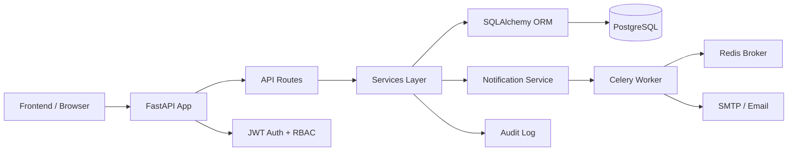
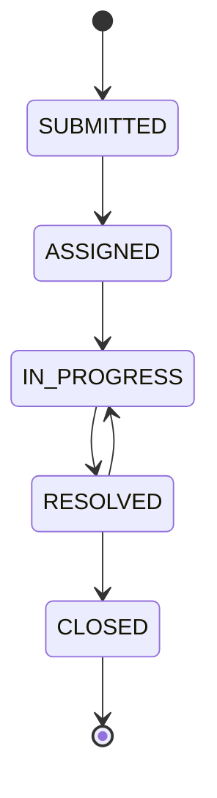
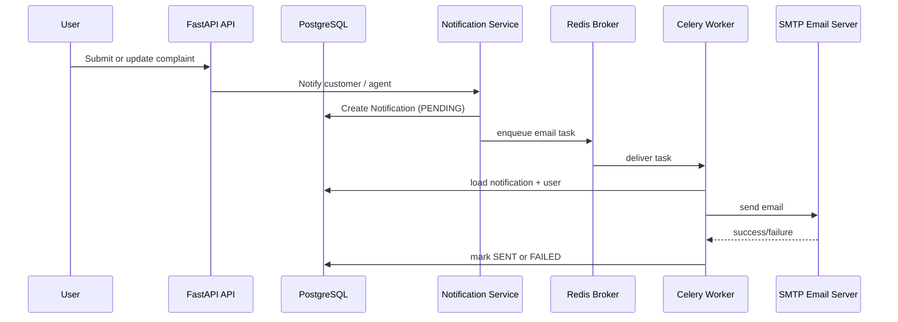
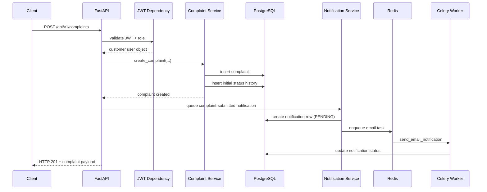

# Entire Backend System Architecture

This document explains the backend as if I were the original designer building it from scratch, then handing it to a developer who cloned it onto a machine and wants to understand how the system was assembled from the first script to the final runtime behavior.

The project is a complaint tracking system for a business context with three user roles:

- Customer
- Agent
- Admin

The backend is designed to support:

- user authentication and authorization
- complaint submission and lifecycle management
- role-aware dashboards
- audit logging
- asynchronous email notifications
- PostgreSQL persistence with migrations

---

## 1. The problem this backend is solving

The system is not just a CRUD API. It is a workflow system.

A customer creates a complaint, an admin assigns it to an agent, the agent updates its status, the customer receives notifications, and the system logs every action for accountability.

That means the real architecture must solve more than just database storage:

- Who can access what?
- How do we protect the API from unauthorized users?
- How do we enforce a valid complaint lifecycle?
- How do we keep a timeline of every state change?
- How do we deliver emails without making the API slow?
- How do we keep the system maintainable and deployable with separate database and queue services?

That is why the design is multi-layered, not just a single Flask or FastAPI file.

---

## 2. The high-level architecture

The backend is built like a classic layered application:

This design separates responsibilities:

- routes handle HTTP requests
- services implement business rules
- models define the data schema
- database handles persistence
- workers handle background work
- Redis decouples the notification pipeline
- JWT secures API access

---

## 3. The first building blocks: environment, dependencies, and runtime setup

### 3.1 requirements.txt

The first technical decision is the stack definition.

The backend relies on:

- FastAPI for the API layer
- Uvicorn for running the app
- SQLAlchemy for ORM and database access
- PostgreSQL driver for PostgreSQL connectivity
- Alembic for schema migration
- Pydantic + Pydantic Settings for configuration and schema validation
- python-jose for JWT
- passlib + bcrypt for password hashing
- Celery + Redis for background task processing
- Jinja2 for HTML email templates
- pytest for testing
- python-multipart for OAuth2 form requests

Why this matters:

This file defines the entire runtime contract of the project. If a developer clones the repo, the first thing they do is install dependencies from this file. It is the foundation of the backend build.

### 3.2 Runtime setup

The backend is intended to run as a Python application.

The runtime setup includes:

1. installing dependencies from `requirements.txt`
2. starting the app with Uvicorn
3. ensuring PostgreSQL and Redis are available before the app starts

The system is designed to work with environment-driven configuration, which allows it to run in local development, staging, or production environments without hardcoded values.

---

## 4. The configuration system: centralizing environment-driven settings

### 4.1 app/core/config.py

This file is the application’s central configuration board.

It loads values from environment variables, including:

- app name and debug mode
- API version prefix
- database URL
- secret key for JWT signing
- token expiration
a- Redis URL
- SMTP configuration for email
- frontend URL for CORS

Why this is important:

A real backend must be adaptable across environments. The same code should work in:

- local development
- staging
- production

Instead of hardcoding secrets or URLs in code, the system reads them from environment variables. This keeps the app secure, portable, and clean.

The file also exposes properties like email_enabled and is_production so the code can decide whether email sending is active and what logging or behavior should be used in each environment.

---

## 5. The database foundation: models, base, and schema

### 5.1 app/db/base.py

This defines the SQLAlchemy base class and timestamp mixin.

Every model inherits from Base, and every table gets:

- created_at
- updated_at

This avoids repeating timestamp logic. It standardizes lifecycle tracking across tables.

### 5.2 app/db/models/user.py

This is the user identity model.

It stores:

- id
- name
- email
- hashed_password
- role
- is_active
- created_at / updated_at

The role is an enum with values:

- CUSTOMER
- AGENT
- ADMIN

This supports the whole RBAC design. The system is not trying to determine permissions by ad hoc flags. It uses a proper role domain model.

The relationship definitions matter here too:

- a user can submit many complaints
- a user can be assigned many complaints
- a user can receive many notifications

This is the heart of the domain model.

### 5.3 app/db/models/complaint.py

This is the main business entity in the system.

A complaint has:

- customer_id
- assigned_agent_id
- title
- description
- status
- priority
- resolved_at
- timestamps

The complaint lifecycle is represented as a strict enum state machine:

The system defines `VALID_TRANSITIONS` so the backend enforces a valid complaint flow. That keeps business rules consistent and prevents bad status changes.

### 5.4 app/db/models/complaint_history.py

This is one of the most important audit features in the system.

The system stores a historical snapshot of every status change:

- complaint_id
- old_status
- new_status
- changed_by
- comment
- created_at

This is not just a transaction log. It is a business timeline that the frontend can render as a complaint history panel.

Why this matters:

Without this table, the frontend would have no reliable way to render who changed the complaint and why.

### 5.5 app/db/models/notification.py

This table tracks the lifecycle of email notifications:

- PENDING
- SENT
- FAILED

This is the bridge between the app logic and asynchronous delivery.

The design says: the API should create a notification record immediately, then a background worker handles email delivery later. So the email system does not block the user experience.

### 5.6 app/db/models/audit_log.py

This is the system’s institutional memory.

It tracks administrative actions like:

- user creation
- complaint assignment
- status changes
- system decisions made by admins

The details field stores JSON metadata, which means the system can grow without needing new columns constantly.

This is critical for any real governance or compliance requirement.

---

## 6. Database migration system: the long-term schema blueprint

### 6.1 alembic/env.py

Alembic is configured to read the same database URL from the application config.

This is important because the migration tool must be consistent with the application environment. You do not want the app to use one database and migrations to use another.

The file also imports all models via `app.db.models` so that Alembic knows every table and can autogenerate the schema.

### 6.2 alembic/versions/..._initial_schema.py

This is the actual schema migration that creates the initial tables:

- users
- audit_logs
- complaints
- complaint_status_history
- notifications

This migration is critical because it translates the declarative models into actual PostgreSQL tables. Without it, the ORM models would exist only in Python and the database would have no structure.

The migration also creates indexes, foreign keys, and enum types that enforce the system design.

---

## 7. The database connection layer: SQLAlchemy session management

### 7.1 app/db/session.py

This file creates the database engine and session factory.

The app uses a synchronous SQLAlchemy session for simplicity and reliability. This is a deliberate architectural choice.

The important parts are:

- engine = create_engine(...)
- SessionLocal = sessionmaker(...)
- get_db(): yields a per-request database session

This pattern is one of the classic FastAPI design patterns. Each request gets its own DB session, and the session closes automatically at the end of the request.

This prevents session leakage and keeps the app predictable.

---

## 8. Security layer: authentication and authorization

### 8.1 app/core/security.py

This file handles the two most important identity functions in the system:

- password hashing
- JWT creation and decoding

It uses bcrypt for password hashing because bcrypt is intentionally slow and therefore resistant to brute-force attacks.

It uses JWT with HS256 signing. The token carries:

- sub = user ID
- role = user role
- exp = expiration time

This means the application can authorize requests without re-reading the whole user record on every request, although the route dependency still fetches the user from the database to validate active status and identity.

### 8.2 app/core/dependencies.py

This is where the runtime permission system is enforced.

The two main dependencies are:

- get_current_user
- require_role(*roles)

The flow is:

1. read the JWT from the Authorization header
2. decode it
3. extract the user ID
4. query the user from the database
5. reject if the user is missing or inactive

Then `require_role` wraps this to enforce specific permissions such as:

- admin-only routes
- agent-or-admin routes
- customer-only routes

This is the actual authorization mechanism that makes the backend role-aware.

---

## 9. API layer: the contract the frontend consumes

### 9.1 app/api/v1/router.py

This aggregates all versioned route modules.

The app groups endpoints under `/api/v1` and includes feature routers for:

- auth
- complaints
- users
- dashboard

This is a clean and scalable pattern. The backend can later add `/api/v2` without rewriting the existing app.

### 9.2 app/api/v1/auth.py

This module represents the authentication boundary.

It exposes:

- register
- login
- get current user profile

Login uses OAuth2PasswordRequestForm, which matches FastAPI Swagger conventions. Even though the field is named `username`, the code treats it as the email address because OAuth2 expects that field name.

This is a good example of fastapi ergonomics meeting business needs.

### 9.3 app/api/v1/complaints.py

This is the core operational API for the complaint system.

It supports:

- complaint creation
- list complaints by role
- complaint detail retrieval
- complaint status updates
- complaint assignment
- complaint history viewing

Important design note:

The route layer does not directly enforce every business rule. It checks authorization and then delegates to the service layer. This makes the rules consistent and reusable.

### 9.4 app/api/v1/users.py

This module handles administrator management of user accounts.

The app allows admins to:

- list users
- create agent/admin accounts
- list active agents
- update user records

This is how the system enforces the non-public staff side of the architecture.

### 9.5 app/api/v1/dashboard.py

This returns summaries tailored to each role.

The dashboard endpoint does not require the frontend to compute counts manually. The backend pre-aggregates and returns role-specific information as a nice schema object.

This reduces frontend complexity and keeps reporting logic in one managed place.

---

## 10. Main app entry point: HTTP surface and CORS

### 10.1 app/main.py

This is the application bootstrap file.

It configures:

- FastAPI app metadata
- logging
- CORS middleware
- router inclusion
- health endpoint

This is the place where the API becomes a running server.

The health endpoint is useful for container orchestration and monitoring. The CORS policy is intentionally not open to all origins; it restricts access to the frontend URL and localhost for development.

This is a serious security decision and part of the architecture’s defensive posture.

---

## 11. Service layer: where business logic lives

This is the most important conceptual layer in the backend.

The route handlers are intentionally thin. They do not contain the real business rules. Instead, the services hold the logic.

### 11.1 app/services/auth_service.py

This service handles:

- customer self-registration
- credential verification
- token creation

The logic ensures the email is unique and password is hashed before storage.

### 11.2 app/services/complaint_service.py

This is the heart of the system’s domain logic.

It implements:

- complaint creation
- complaint retrieval
- complaint listing by customer or agent
- complaint status transitions
- assignment rules
- complaint history creation

This is where the state machine is enforced.

Example rules:

- a complaint can only move to allowed statuses
- assignment requires an active agent
- status updates create a history record
- resolved complaints get a resolution timestamp

This is a business logic core rather than just a DB wrapper.

### 11.3 app/services/user_service.py

This service manages non-customer users.

It supports admin operations and is isolated from the general public registration flow.

### 11.4 app/services/dashboard_service.py

This service builds role-specific summaries for the UI.

It uses queries like total complaints, open complaints, resolved complaints, agent metrics, and recent assignments.

This helps the frontend render rich dashboards without making many separate API calls.

### 11.5 app/services/audit_service.py

This service writes audit events after important changes.

This is how the system records the who/what/when of administrative changes, ensuring traceability.

### 11.6 app/services/notification_service.py

This is the notification orchestration service.

It does two things:

1. creates a notification record in the database
2. enqueues a Celery background task

It also renders HTML email templates using Jinja2, which makes the email logic clean and reusable.

---

## 12. Pydantic schemas: API contract and validation

The application uses Pydantic schemas to validate input and shape output.

Key files include:

- schemas/auth.py
- schemas/user.py
- schemas/complaint.py
- schemas/dashboard.py

These files define:

- request bodies
- response objects
- constraints such as min_length, allowed values, enum patterns
- serialization from ORM models to JSON

This is necessary because FastAPI uses Pydantic to validate data automatically and return typed API responses.

The schema layer keeps the API consistent and reduces bugs caused by manual JSON handling.

---

## 13. Asynchronous email pipeline: Celery and Redis

This is where the system becomes more enterprise-like.

### 13.1 app/workers/celery_app.py

This configures the Celery app using Redis as:

- message broker
- result backend

The app uses Celery because email sending should not slow down the API request lifecycle.

The task settings include:

- JSON serialization
- timezone configuration
- task ack late for reliability
- prefetch of one task at a time for fair scheduling

### 13.2 app/workers/tasks.py

This is the task implementation. The function `send_email_notification` does the real work:

- loads the notification record
- loads the user
- sends the email via SMTP if configured
- otherwise logs in development mode
- updates the status to SENT or FAILED
- retries failed tasks up to a limit

This is a classic pattern: commit the action record first, then process asynchronously with retry capability.

### 13.3 notification flow

This design is resilient because the API request is not blocked by SMTP delays.

---

## 14. Why the backend architecture matches the business demands

The system was not built randomly. Every major component exists to satisfy a real business need.

### Need: secure authentication and access control

Solution:

- JWT-based auth
- hashed passwords
- role enum
- dependency checks

### Need: strict workflow for complaints

Solution:

- complaint state machine
- service-layer validation
- status history capturing every change

### Need: business accountability

Solution:

- audit_logs table
- complaint_history table
- changed_by metadata

### Need: scalable email processing

Solution:

- Redis + Celery
- background task queue
- notification persistence before sending

### Need: maintainable data model

Solution:

- ORM models
- migration system
- timestamp mixins
- central config

### Need: operational safety and deployment

Solution:

- Docker Compose
- health checks
- DB and queue dependency ordering
- migration before app start

---

## 15. The runtime lifecycle of a request

If a customer logs in and submits a complaint, the flow looks like this:

This is the whole system in motion.

---

## 16. The role-based system in plain English

### Customer

- registers account
- submits complaints
- sees only their own complaints
- receives status and resolution notifications
- sees customer dashboard

### Agent

- receives assigned complaints
- updates complaint status
- sees only their assigned complaints
- receives assignment/update notifications

### Admin

- creates agent/admin accounts
- assigns complaints
- sees all complaints and system metrics
- monitors performance and system status
- manages users and activity

This balance is the heart of the backend’s domain model.

---

## 17. The “from first script to last script” story

If I were reconstructing the build process from the beginning, it would look like this:

1. Write the dependency manifest (`requirements.txt`) so the Python runtime is defined.
2. Create the Docker build (`Dockerfile`) so the backend has a repeatable environment.
3. Define the orchestration stack (`docker-compose.yml`) so the database, Redis, backend, worker, and frontend can run together.
4. Build the application configuration (`app/core/config.py`) so environment variables drive runtime behavior.
5. Create the base ORM classes (`app/db/base.py`) to standardize database patterns.
6. Define the domain models (`app/db/models/...`) for users, complaints, notifications, history, and audit logs.
7. Create Alembic migration files to turn models into real PostgreSQL tables.
8. Create the database session layer (`app/db/session.py`) so every request gets a consistent DB connection.
9. Build auth security (`app/core/security.py`) and route auth dependencies (`app/core/dependencies.py`) to secure the system.
10. Create the API routers (`app/api/v1/...`) to expose the system over HTTP.
11. Create the service layer to house business logic (`services/...`) and isolate routing from rules.
12. Add the schema layer (`schemas/...`) to validate and serialize API data.
13. Add background task infrastructure (`app/workers/...`) and Redis-driven async email delivery.
14. Create a seed script (`scripts/seed.py`) to populate the app with realistic sample data for local demonstrations.
15. Run migrations, start the app, and operate the system through the API and dashboards.

This is the full life cycle of the project from foundation to deployment-ready architecture.

---

## 18. Final design judgment

This backend is not just an API. It is a small business process system built on top of a relational database and event-driven notifications.

It demonstrates a strong real-world architecture:

- layered application design
- secure role-based access control
- persistent audit and history model
- state enforcement in the domain service layer
- asynchronous non-blocking notification processing
- dockerized local environment
- migration-based schema evolution

If someone cloned this repository, they would be able to understand the whole system by following the natural sequence:

- start from the runtime definition
- then the infrastructure and config
- then the data model and migration
- then the security and auth layer
- then the service logic
- then the API routes
- then the asynchronous workers
- then the seed and demonstration data

That is the complete journey from the very beginning to the end of the backend design.
